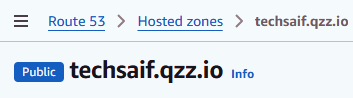
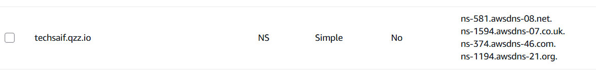
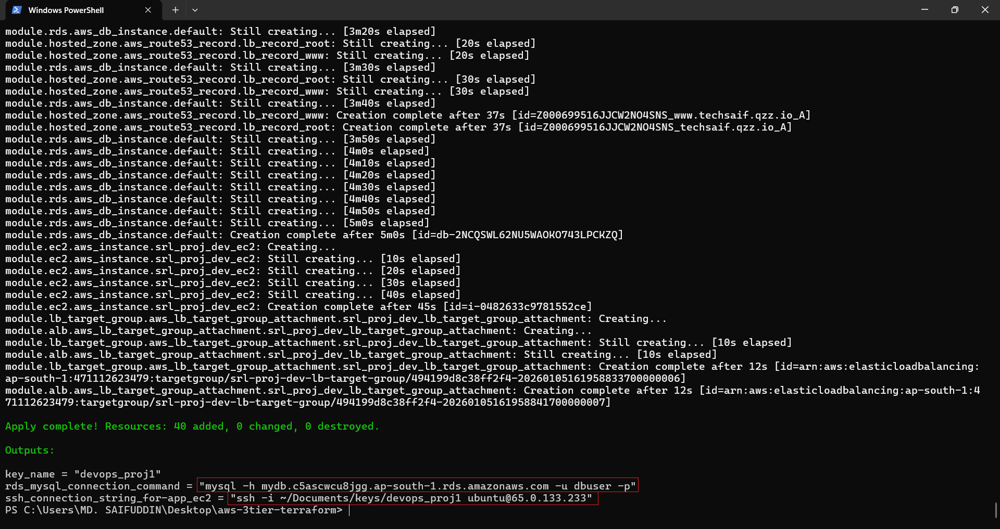
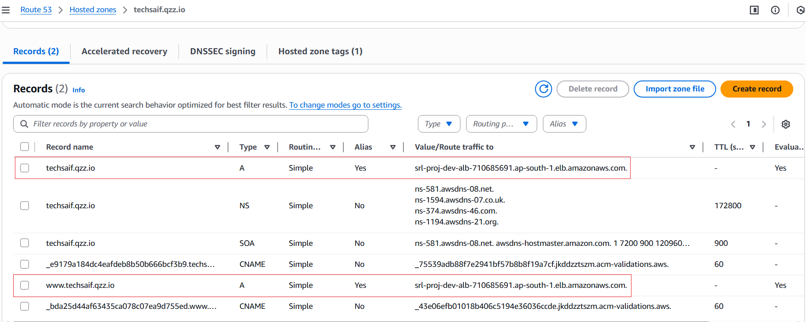
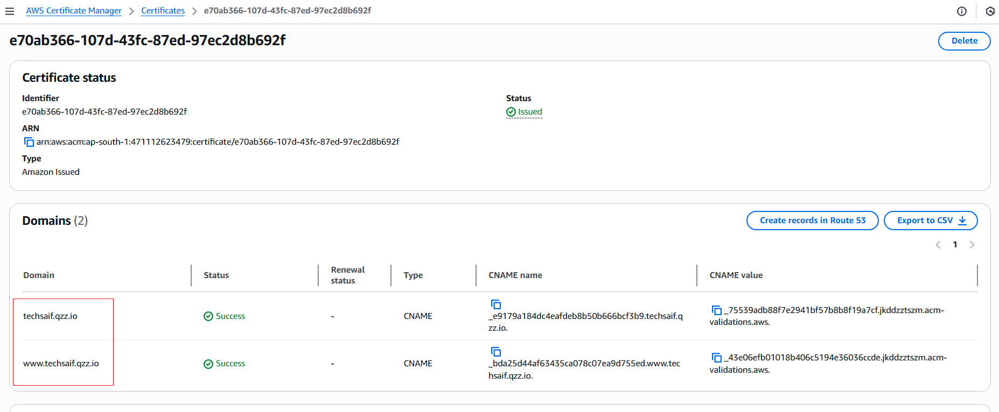

## Project Overview

#### Main components:

- ➡️ Custom VPC with public subnets, Private subnet, Nat gateway, EIP, Internet Gateway, and route tables
- ➡️ Security Groups for Flask-App(EC2), RDS(MysQl) and ALB
- ➡️ EC2 Instance for Flask (with User Data installation & DB setup script)
- ➡️ Target Group and Application Load Balancer (ALB) setup
- ➡️ RDS Instance for MysQl
- ➡️ S3 Bucket
- ➡️ IAM Role to access S3 from Ec2
- ➡️ ACM Certificate for HTTPS
- ➡️ DNS Integration with Route 53

## Prerequisites
Before Running Terraform, Make sure you have the following prerequisites ready:

- ➡️ Terraform v1.3+ (recommended)
- ➡️ AWS CLI configured with proper IAM credentials
- ➡️ A registered domain name (e.g., from GoDaddy, Namecheap, etc.)
- ➡️ Hosted Zone created in Route 53 — Example: hosted zone name: techsaif.gzz.io
- ➡️ Name Servers updated at your domain registrar
- ➡️ Public and Private Key

  ## *Step 1:* 
### Setup Hosted Zone :
To work with this whole setup we need to setup  Route53 and in Route53 we first need to setup our hosted zone.

- 1️⃣  Navigate to Route 53 → Hosted zones → Create hosted zone
- 2️⃣  In the Domain name field, enter the exact domain name you own (e.g., techsaif.gzz.io)
- 3️⃣  Select Type → Public hosted zone
- 4️⃣  Click Create hosted zone
---

 <p align="left">
  
</p>

---
- 5️⃣ Once you created you will get four records which is **"ns records"**.

  <p align="left">
  
  </p>
  
  ---

- 6️⃣ Update these ns recode over your domine register's ns recode.

  <p align="left">
  
  </p>

  ---

## *Step 2:*
####  Clone the repo:
   ```bash
   git clone https://github.com/xrootms/https://github.com/xrootms/aws-2tier-architecture-terraform.git
   cd aws-2tier-architecture-terraform

#### 2. Copy and edit variables: (Update variable values as needed — VPC, CIDR, public key, region, etc.)
   ```bash
   cp terraform.tfvars.example terraform.tfvars
   ```
#### 3. Initialize Terraform:
   ```bash
   terraform init
   ```
#### 4. Plan and Apply:
   ```bash
   terraform plan
   terraform apply
   ```
#### 5. Get ssh connection for EC2:

<p align="left">
  
</p>

---
## *After successful deployment:*

🔹**Hosted zone:**

  - *The ALB DNS name is mapped to techsaif.gzz.io using a Route 53 A record*

<p align="left">
  
</p

🔹**SSL Configuration:**
  - *An ACM Certificate is created for: techsaif.gzz.io and attached to the ALB for https traffic.*

<p align="left">
  
</p

🔹**EC2 Installation (User Data):**

  - *During EC2 instance creation, a user data script automatically installs app + configures database.*
  - **Script used:** template/ec2_install_app.sh*

🔹**Accessing Jenkins:**
  - *Once Terraform apply completes and DNS propagation finishes:*
  - *Open https://jenkins.techsaif.gzz.io in your browser.*
  - 
<p align="left">
  
</p


---  
**Notes**
- ➡️ ACM and ALB must be in the same AWS region
- ➡️ DNS propagation may take up to 30 minutes
- ➡️ Check ACM validation status in AWS Console → Certificate Manager
- ➡️ To avoid unnecessary costs, destroy the infrastructure when no longer needed

```bash
terraform destroy    
```

  ⭐ If you found this project interesting, consider giving it a star!


# Multi-Tier Architecture on AWS using Terraform & Jenkins!!
---

## 🖼️ **Architecture Overview**

multi-tier-aws/

├─ ansible/
│  └─ main.tf
│
├─ jenkins/
│  └─ main.tf
├─ docs/
│  └─ architecture-diagram.png
└─ README.md


---

## 📋 **Project Overview**

A fully automated deployment of a **multi-tier web application architecture** on **AWS**. The infrastructure consists of a VPC with public and private subnets, Internet Gateway, NAT Gateway, **Application Load Balancer**, **EC2 instances** (for web and app tiers), and **RDS** (for database tier). **Terraform** was used for infrastructure provisioning, **Jenkins** for continuous integration and delivery, and **Docker** for application containerization.

---

## 📊 **Project Details**

| **Details** | **Information** |
|--------------|-----------------|
| 🏢 **Organization** | Solution Ltd. |
| 👥 **Team Size** | 3 |
| 🧰 **Technology Stack** | AWS, Git, Jenkins, Docker, Terraform, Ansible, Flask, MySQL, CloudWatch |
| 🕓 **Duration** | Ongoing / Completed (as applicable) |

---

## ⚙️ **Role & Responsibilities**

- Setup and managed a highly available 3-tier architecture on AWS using Terraform modules. 
- Configured Jenkins pipelines for automated build, test, and deployment processes. 
- **Containerized** the web and app layers using **Docker** and deployed them on **EC2 instances**.  
- Used Ansible for configuration management, Set up **Nginx** as a reverse proxy and load balancer. 
- Integrated **AWS CloudWatch** for monitoring and centralized logging.  
- Applied **IAM roles**, **security groups**, and **private subnets** for secure deployments.
- Cost optimization: using Auto Scaling, right-sized and reserved instances, and automated EC2 scheduling to stop/start non-production servers and databases when not in use, while monitoring spend with AWS Cost Explorer.


fficient resource scheduling to turn off or scale down non-production servers and databases when not in use 
---

## **Outcome**

✅ Automated end-to-end infrastructure provisioning and deployment.  
✅ Improved scalability, security, and monitoring across environments.  
✅ Reduced manual effort through **CI/CD** and **Infrastructure as Code (IaC)** automation.

---

##  **Key Learnings**

- Deep understanding of **Terraform** for reusable infrastructure modules.  
- Practical experience with **Jenkins pipelines** for automation.  
- Hands-on with **AWS networking**, **load balancing**, and **monitoring**.  
- Improved workflow efficiency through **IaC** and **DevOps best practices**.

---

⭐ **If you found this project interesting, consider giving it a star!**  
🔗 *#AWS #Terraform #Jenkins #DevOps #Cloud #InfrastructureAsCode*

